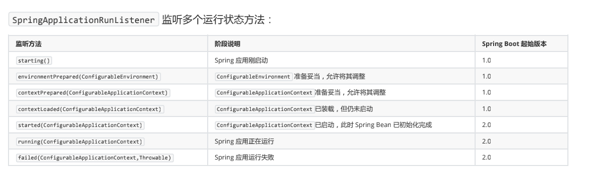
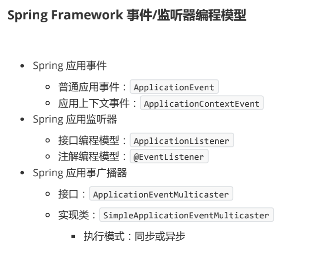

# 理解 SpringApplication
## SpringApplication 基本使用
SpringApplication 是spring应用的引导类 提供便利的自定义行为方法
应用在嵌入式web应用和非web应用

普通运行
```java
SpringApplication.run(HelloWorldApplication.class,args);
```
自定义SpringApplication
```java
SpringApplication springApplication = new SpringApplication(DiveInSpringBootApplication.class); 
springApplication.setBannerMode(Banner.Mode.CONSOLE); 
springApplication.setWebApplicationType(WebApplicationType.NONE); 
springApplication.setAdditionalProfiles("prod"); 
springApplication.setHeadless(true);
```
自定义SpringApplication 使用SpringApplicationBuilder流式编程（功能和上面一样）
```java
new SpringApplicationBuilder(DiveInSpringBootApplication.class) 
                             .bannerMode(Banner.Mode.CONSOLE) 
                             .web(WebApplicationType.NONE) 
                             .profiles("prod") 
                             .headless(true) 
                             .run(args);
```
## SpringApplication 准备阶段
### 1.配置 Spring Boot Bean 源
Java 配置 Class 或 XML 上下文配置文件集合，用于 Spring Boot BeanDefinitionLoader 读取 ，并且将配置源解析加载为
Spring Bean 定义
数量：一个或多个以上
Java 配置 Class
用于 Spring 注解驱动中 Java 配置类，大多数情况是 Spring 模式注解所标注的类，如 @Configuration 。
XML 上下文配置文件
用于 Spring 传统配置驱动中的 XML 文件。
 @SpringBootApplication 是一个模式注解（@SpringBootApplication <-@SpringBootConfiguration <-  @Configuration）
 用@SpringBootApplication 注解的类是一个配置类
查看SpringApplication方法发现 primarySources 可以是一个用模式注解 classname或者 packagename 或者是xml路径
```java
    public SpringApplication(Class<?>... primarySources) {
        this((ResourceLoader)null, primarySources);
    }
```
BeanDefinitionLoader 
```java
BeanDefinitionLoader(BeanDefinitionRegistry registry, Object... sources) {
        Assert.notNull(registry, "Registry must not be null");
        Assert.notEmpty(sources, "Sources must not be empty");
        this.sources = sources;
        this.annotatedReader = new AnnotatedBeanDefinitionReader(registry);
        this.xmlReader = XML_ENABLED ? new XmlBeanDefinitionReader(registry) : null;
        this.groovyReader = this.isGroovyPresent() ? new GroovyBeanDefinitionReader(registry) : null;
        this.scanner = new ClassPathBeanDefinitionScanner(registry);
        this.scanner.addExcludeFilter(new BeanDefinitionLoader.ClassExcludeFilter(sources));
    }
```
从下面例子可以看出 只要SpringApplication()传入的类只要有模式注解就行 
```java
public class HelloWorldApplication {

    public static void main(String[] args) {
        Set<String> sources = new HashSet<>();
        sources.add(AA.class.getName());
        SpringApplication springApplication = new SpringApplication();
        springApplication.setSources(sources); //这里的源可以是一个带有spring模式注解的类名称 或者xml路径
        ConfigurableApplicationContext context = springApplication.run(args);
        //Java 配置 Class 或 XML 上下文配置文件集合，用于 Spring Boot BeanDefinitionLoader 读取 ，并且将配置源解析加载为Spring Bean 定义
        System.out.println("bean: "+ context.getBean(AA.class));
        //bean: com.bootstrap.HelloWorldApplication$AA$$EnhancerBySpringCGLIB$$823c6e86@3e134896
    }
    
    @SpringBootApplication
    public static class AA{

    }
}
```
### 2. 推断 Web 应用类型
根据当前应用 ClassPath 中是否存在相关实现类来推断 Web 应用的类型，包括：
Web Reactive： WebApplicationType.REACTIVE 
Web Servlet： WebApplicationType.SERVLET 
非 Web： WebApplicationType.NONE
参考方法： org.springframework.boot.SpringApplication#deduceWebApplicationType
如果加载类中有DispatcherHandler 或者DispatcherServlet  返回WebApplicationType.REACTIVE  默认返回WebApplicationType.SERVLET  如果没有返回 WebApplicationType.NONE
```java
 private WebApplicationType deduceWebApplicationType() {
            if (ClassUtils.isPresent("org.springframework.web.reactive.DispatcherHandler", 
                    (ClassLoader)null) && !ClassUtils.isPresent("org.springframework.web.servlet.DispatcherServlet", 
                    (ClassLoader)null) && !ClassUtils.isPresent("org.glassfish.jersey.server.ResourceConfig", (ClassLoader)null)) 
            {
                return WebApplicationType.REACTIVE;
            } else {
                String[] var1 = WEB_ENVIRONMENT_CLASSES;
                int var2 = var1.length;

                for(int var3 = 0; var3 < var2; ++var3) {
                    String className = var1[var3];
                    if (!ClassUtils.isPresent(className, (ClassLoader)null)) {
                        return WebApplicationType.NONE;
                    }
                }

                return WebApplicationType.SERVLET;
            }
```
### 3. 推断引导类（Main Class）
根据 Main 线程执行堆栈判断实际的引导类
根据线程是否存在main来推断
参考方法： org.springframework.boot.SpringApplication#deduceMainApplicationClass
```java
private Class<?> deduceMainApplicationClass() {
        try {
            StackTraceElement[] stackTrace = (new RuntimeException()).getStackTrace();
            StackTraceElement[] var2 = stackTrace;
            int var3 = stackTrace.length;

            for(int var4 = 0; var4 < var3; ++var4) {
                StackTraceElement stackTraceElement = var2[var4];
                if ("main".equals(stackTraceElement.getMethodName())) {
                    return Class.forName(stackTraceElement.getClassName());
                }
            }
        } catch (ClassNotFoundException var6) {
        }

        return null;
    }
```
### 4. 加载应用上下文初始器 （ ApplicationContextInitializer ）
利用 Spring 工厂加载机制，实例化 ApplicationContextInitializer 实现类，并排序对象集合。
技术
实现类： org.springframework.core.io.support.SpringFactoriesLoader
配置资源： META-INF/spring.factories
```java
public final class SpringFactoriesLoader {
    public static final String FACTORIES_RESOURCE_LOCATION = "META-INF/spring.factories";
    private static final Log logger = LogFactory.getLog(SpringFactoriesLoader.class);
    static final Map<ClassLoader, Map<String, List<String>>> cache = new ConcurrentReferenceHashMap();

    private SpringFactoriesLoader() {
    }

    public static <T> List<T> loadFactories(Class<T> factoryType, @Nullable ClassLoader classLoader) {
        Assert.notNull(factoryType, "'factoryType' must not be null");
        ClassLoader classLoaderToUse = classLoader;
        if (classLoader == null) {
            classLoaderToUse = SpringFactoriesLoader.class.getClassLoader();
        }

        List<String> factoryImplementationNames = loadFactoryNames(factoryType, classLoaderToUse);
        if (logger.isTraceEnabled()) {
            logger.trace("Loaded [" + factoryType.getName() + "] names: " + factoryImplementationNames);
        }

        List<T> result = new ArrayList(factoryImplementationNames.size());
        Iterator var5 = factoryImplementationNames.iterator();

        while(var5.hasNext()) {
            String factoryImplementationName = (String)var5.next();
            result.add(instantiateFactory(factoryImplementationName, factoryType, classLoaderToUse));
        }

        AnnotationAwareOrderComparator.sort(result);
        return result;
    }
```
排序： AnnotationAwareOrderComparator#sort

### 5.加载应用事件监听器（ ApplicationListener ）
利用 Spring 工厂加载机制，实例化 ApplicationListener 实现类，并排序对象集合

### 总结（SpringApplication准备阶段）
SpringApplication 构造方法
```java
public SpringApplication(ResourceLoader resourceLoader, Class<?>... primarySources) {
        this.sources = new LinkedHashSet();
        this.bannerMode = Mode.CONSOLE;
        this.logStartupInfo = true;
        this.addCommandLineProperties = true;
        this.addConversionService = true;
        this.headless = true;
        this.registerShutdownHook = true;
        this.additionalProfiles = Collections.emptySet();
        this.isCustomEnvironment = false;
        this.lazyInitialization = false;
        this.applicationContextFactory = ApplicationContextFactory.DEFAULT;
        this.applicationStartup = ApplicationStartup.DEFAULT;
        this.resourceLoader = resourceLoader;
        Assert.notNull(primarySources, "PrimarySources must not be null");
        //配置 Spring Boot Bean 源
        this.primarySources = new LinkedHashSet(Arrays.asList(primarySources));
        //推断 Web 应用类型
        this.webApplicationType = WebApplicationType.deduceFromClasspath();
        //利用 Spring 工厂加载机制，实例化
        this.bootstrapRegistryInitializers = this.getBootstrapRegistryInitializersFromSpringFactories();
        //加载应用上下文初始器
        this.setInitializers(this.getSpringFactoriesInstances(ApplicationContextInitializer.class));
        //加载应用事件监听器
        this.setListeners(this.getSpringFactoriesInstances(ApplicationListener.class));
        //推断引导类（Main Class）
        this.mainApplicationClass = this.deduceMainApplicationClass();
    }
```
## SpringApplication 运行阶段
### 1. 加载 SpringApplication 运行监听器（ SpringApplicationRunListeners ）
利用 Spring 工厂加载机制，读取 SpringApplicationRunListener 对象集合，并且封装到组合类
SpringApplicationRunListeners
### 2. 运行 SpringApplication 运行监听器（ SpringApplicationRunListeners ）

### 3. 监听 Spring Boot 事件 / Spring 事件
Spring Boot 通过 SpringApplicationRunListener 的实现类 EventPublishingRunListener 利用 Spring Framework 事件
API ，广播 Spring Boot 事件。


### 4. 创建 Spring 应用上下文（ ConfigurableApplicationContext ）
根据准备阶段的推断 Web 应用类型创建对应的 ConfigurableApplicationContext 实例：
Web Reactive： AnnotationConfigReactiveWebServerApplicationContext 
Web Servlet： AnnotationConfigServletWebServerApplicationContext 
非 Web： AnnotationConfigApplicationContext

### 5. 创建 Environment
根据准备阶段的推断 Web 应用类型创建对应的 ConfigurableEnvironment 实例：
Web Reactive： StandardEnvironment Web 
Servlet： StandardServletEnvironment 
非 Web： StandardEnvironment